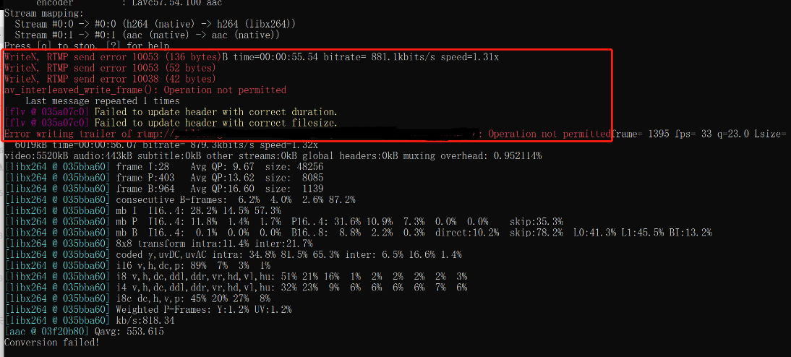

# ffmpeg超速推流srs错误

## 一. 问题

ffmpeg推流srs，如果忘了-re，推流速度稍快，会发生什么？srs运行超速推流呢 还是会倍断掉？
我刚刚遇到推流30-40秒被断开

## 二. 案例
> ffmpeg转推m3u8到srs的rtmp推流一会儿就断开

1. 报警告信息
```
[flv @ 035a07c0] Failed to update header with correct duration.
[flv @ 035a07c0] Failed to update header with correct filesize.
```
错误的时长和错误的filesize导致 无法更新 flv header

2. 解决：加-re参数控制速度
3. 原因：
   - 源地址是m3u8切片，有几个分片的缓存文件
   - 如果不控制速度，ffmpeg会一开始就吧缓存的数据一下全部尽快推流，速度太快被出错
4. 


-flvflags no_duration_filesize