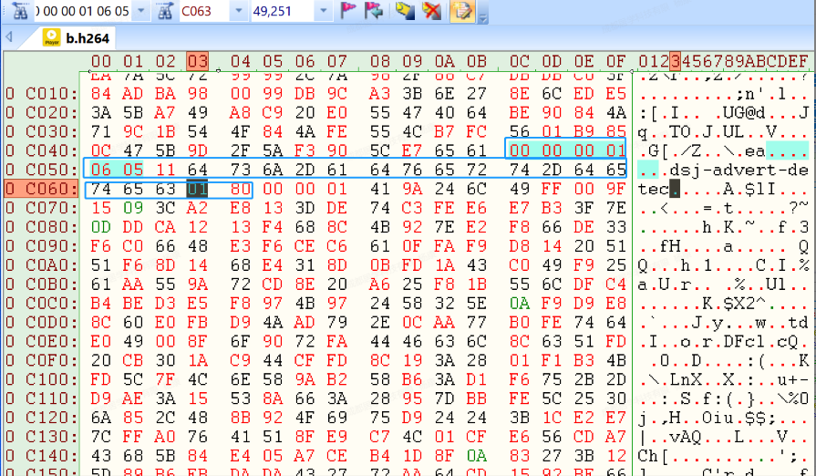
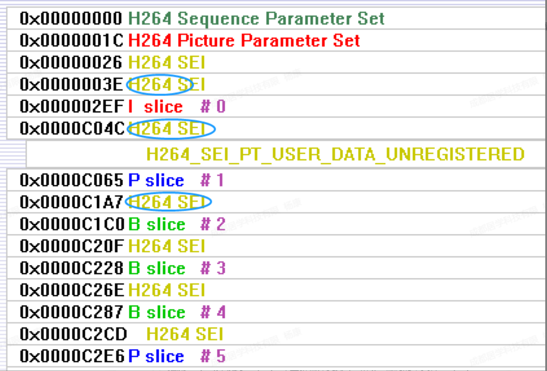
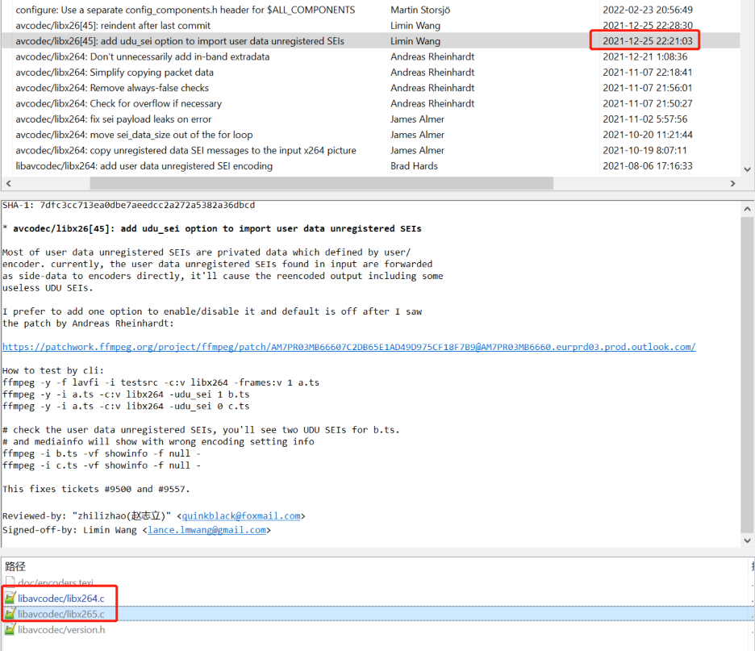

# h264流中插入sei帧存储传输AI信息
> 方案： 把AI信息放到AVFrame的sideData，配合参数(-udu_sei 1)写入到sei帧，支持硬编和软编。

## 一. 在h264流中增加sei帧，标识是否有AI分析，占据25字节。
- 
- 
## 二. 支持软编libx265和英伟达硬编nvenc。
- 21年底，Limin Wang给ffmpeg新增了代码：x264，x265，nvenc等编码时候保留原来的sei信息。 
- ```-udu_sei 1```
- 
## 三. 给ffmpeg增加全局控制参数，控制是否开启AI分析。
## 四. sei帧方案比较稳妥：与帧对应，处理平台不会丢掉。
## 五. 实现
```
static uint16_t ad_detect_index = 1;
//添加到frame的sei，后面编码器会写入
ad_detect_index++;
AVBufferRef *buf = av_buffer_alloc(get_sei_sidedata_size(sizeof(ad_detect_index)));
if (buf) {
    write_sei_sidedata(uuid_dsj, strlen(uuid_dsj), &ad_detect_index, sizeof(ad_detect_index),
    buf->data);
    av_frame_new_side_data_from_buf(frame, AV_FRAME_DATA_SEI_UNREGISTERED, buf);
}
```


