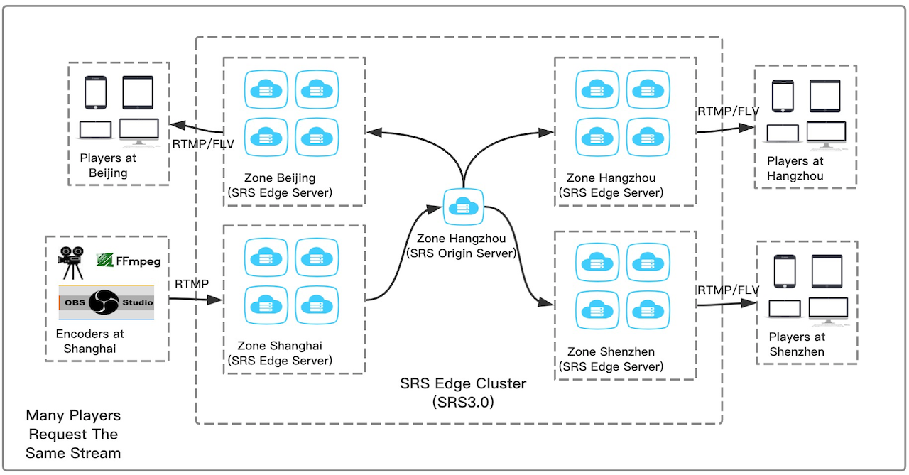
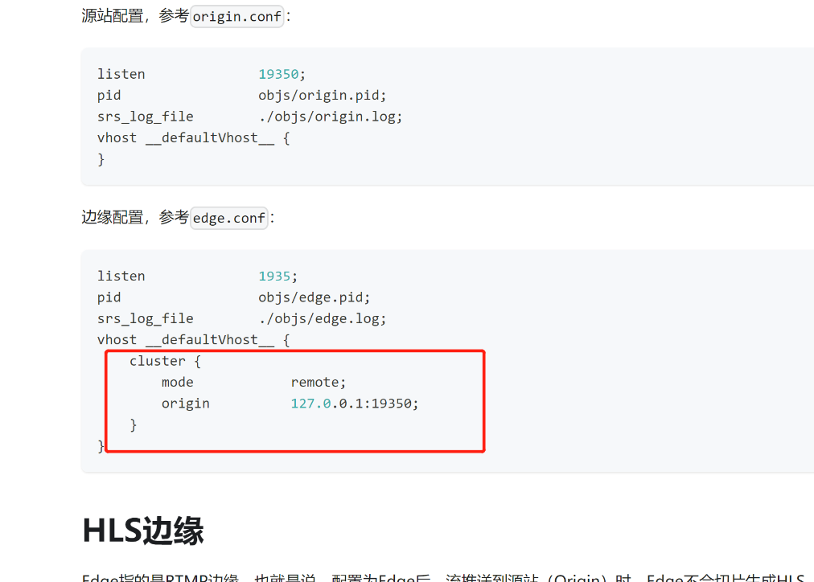

# srs的集群

- 注意：edge可以从源站拉流，也可以将流转发给源站。也就是说，播放edge上的流时，edge会 回源拉流；推流到edge上时，edge会直接将流转发给源站。
- 注意：若只需要中转流给源站，不必用forward，直接使用edge模式即可。可以直接支持推流 和拉流的中转，简单快捷。Forward应用于目标服务器是多个，譬如将一路流主动送给多路服务 器；edge虽然配置了多台服务器，但是只用了一台，有故障时才切换。
- 注意：优先使用edge，除非知道必须用forward，才使用forward。

## srs集群
1. 来srs源站节点拉流，源站集群内部通过http api（1985端口哪个）查询流后Rtmp 302重定向到目标流所在的节点。
    - ffmpeg不支持Rtmp 302重定向，不能去多节点源站拉流
2. 来srs边缘节点拉流，会遍历源站集群，然后保留转发到边缘节点后下发
    - 没有Rtmp 302重定向，ffmpeg支持
3. 往srs源站节点推流
    - 任意节点直接推
4. 往srs边缘节点推流
    - 任意节点直接推,会转发到源站

## 问题
a b c d直接能转发rtmp吗? 用forward？
怎么指定 边缘集群的兄弟节点
