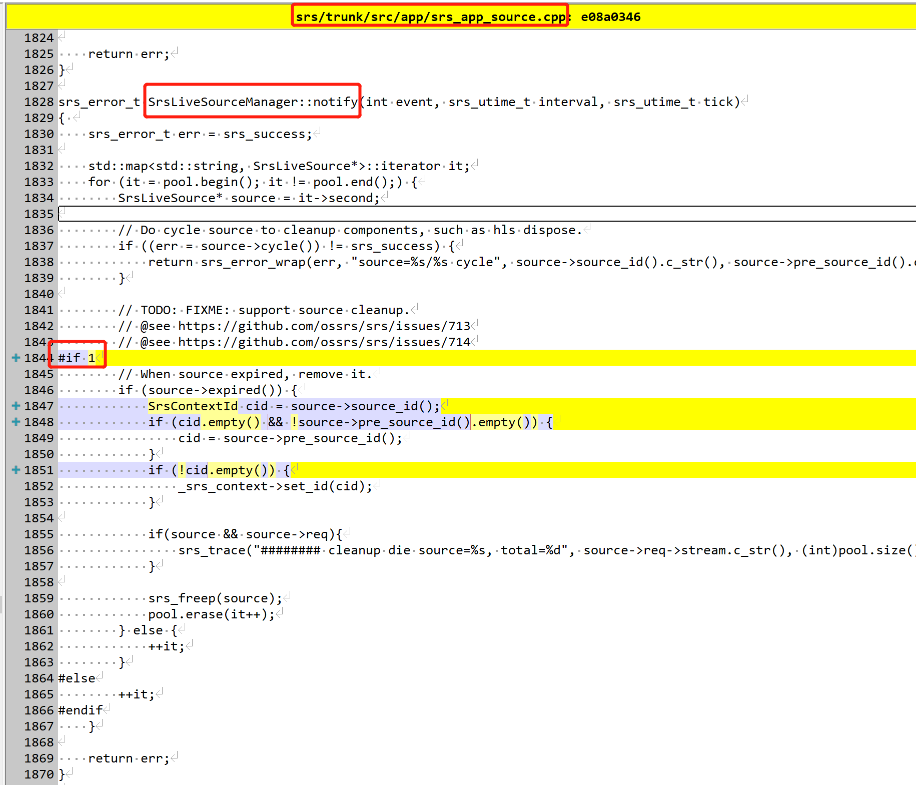

# 修复srs-内存溢出问题
> 原因：srs的source没有清理，每个source缓存了一个gop的信息。
> 
> srs自己有修复这个问题，只是因为存在问题没有开放出来

1. 打开source清理


2. 设置source清理时长：太短会造成崩溃，太长会清理不及时。
```
// the time to cleanup source.
#define SRS_SOURCE_CLEANUP (3600 * SRS_UTIME_SECONDS)
```