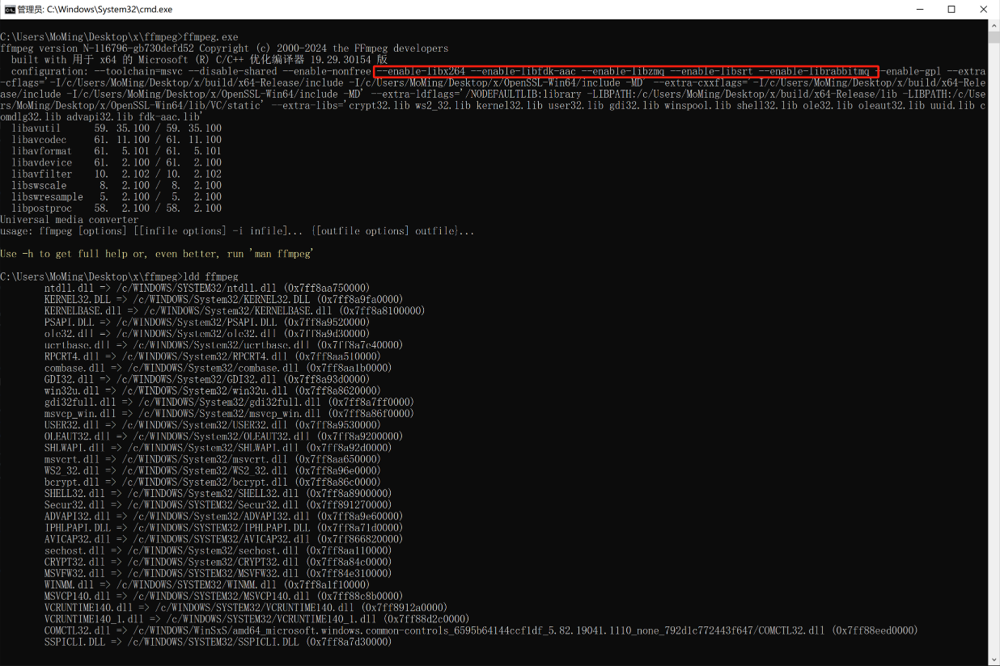

# ffmpeg添加srt和mq在windows的编译

## 一. 目标
在windows编译ffmpeg支持下面这些功能
```
-enable-libx264 --enable-libfdk-aac --enable-libsrt –enable-librabbitmq --enable-libzmq
```

## 二. 结果


## 三. cmake编译三个第三方库
1. 地址：
    - https://code.videolan.org/videolan/x264.git : install到/usr/local/lib
    - fdk-aac-0.1.5
    - https://github.com/zeromq/libzmq.git
    - https://github.com/alanxz/rabbitmq-c.git
    - https://github.com/Haivision/srt.git
2. cmake注意点：
    - cmake去掉：shared，test，example，app
    - 统一使用的默认的/MD
3. 写pkg-config文件xxx.pc注意:
    - 用sys2的linux路径
    - 要引入依赖库
    - 静态库要添加对应的宏
## 四. 统一运行时库
```
 -MD
```
