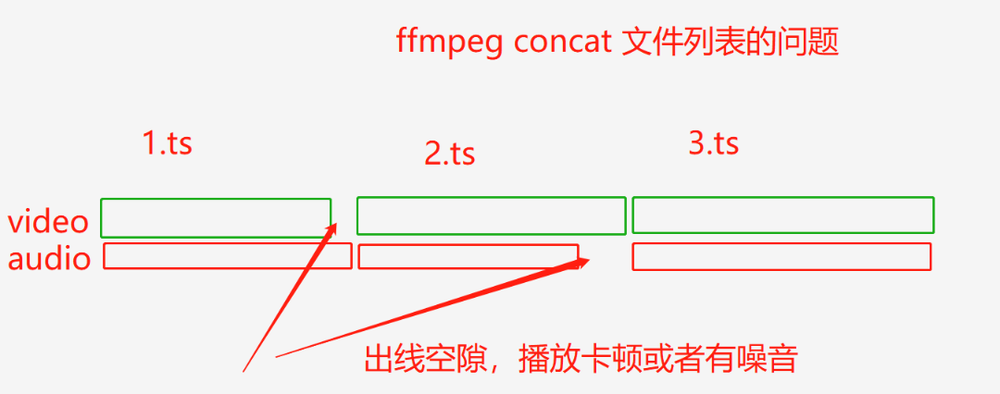
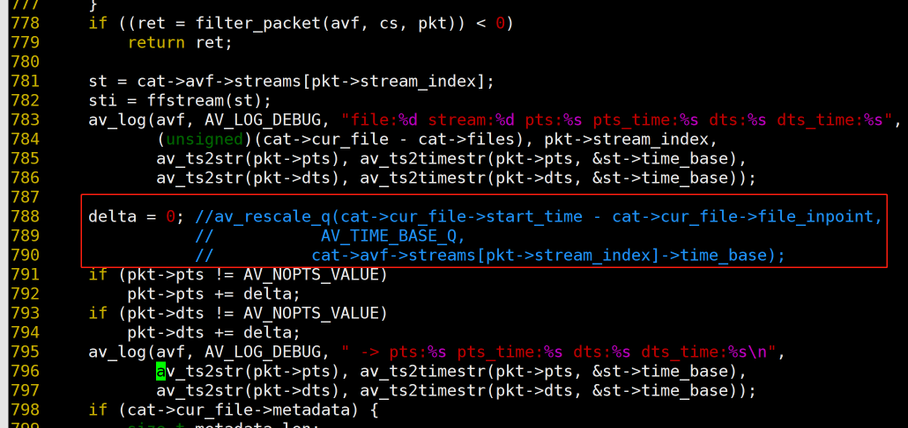

# ffmpeg的文件合并concat的使用注意

## 一. 先说问题
1. 我有几个时间连续的ts文件
2. 遇到一个FFmpeg用concat的坑: ts文件列表写在命令行没问题，写的txt后合并有卡顿和噪音
    - ts文件列表写在命令行
   ```
   ffmpeg -i concat:"0.ts|1.ts|2.ts|3.ts|4.ts|5.ts|6.ts|7.ts|8.ts" -c copy -bsf:a aac_adtstoasc  -y concat-cmd.mp4
   ```
   
    - ts文件列表写在命令行
    ```
    ffmpeg -f concat -i ts.txt -bsf:a aac_adtstoasc  -c copy -y concat-file.mp4 
    
    #ts.txt
    file '0.ts'
    file '1.ts'
    file '2.ts'
    file '3.ts'
    file '4.ts'
    file '5.ts'
    file '6.ts'
    file '7.ts'
    file '8.ts'
   ```

## 二. 调试和分析
1. 分析帧数和时间错发现：
    - 有问题的mp4总时长比没有问题的多两秒
    - 多一个ts文件总时长就增加0.2秒
2. 单步调试ffmpeg的代码，确认问题
   - ffmpeg的concat-dec保证了每个文件内部的音视频时间对齐
   - 但如果每个ts文件本身的音频和视频的长度不同对齐后就出问题。
   - 


## 三. 针对这种情况进行修复
1.  去掉偏移就可以了
    ```
    #vim libavformat/concatdec.c
    delta = 0; //av_rescale_q(cat->cur_file->start_time - cat->cur_file->file_inpoint,
               //           AV_TIME_BASE_Q,
               //          cat->avf->streams[pkt->stream_index]->time_base);
    
    ```
    
## 四. 总结
可见，并不是说ffmpeg的文件合并concat有bug，只是说有些情况可能不适合。