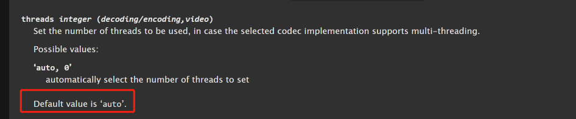
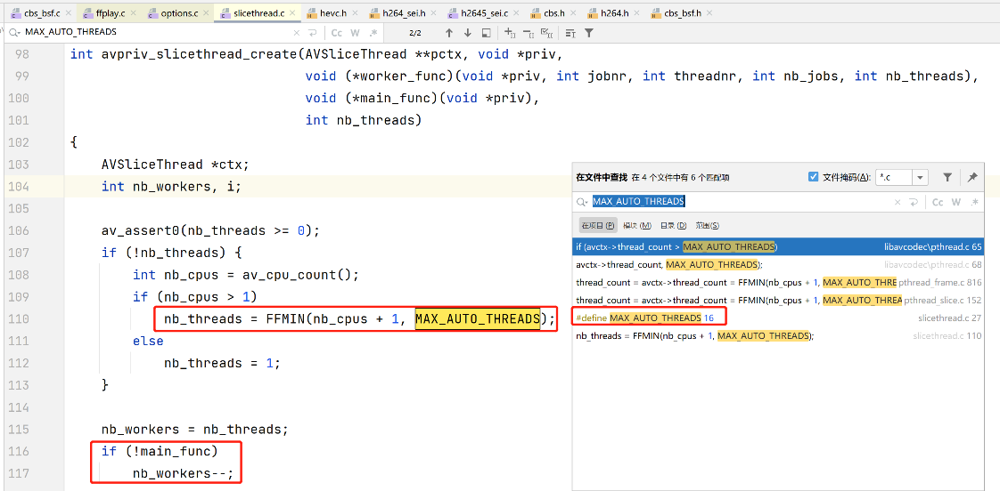

# ffmpeg的线程数控制

1. 默认auto

1. 默认：cpu数+1，最大值16

1. 案例：ffmpeg没有用-re， 拉HLS流转推，cpu占用率高，且成波浪曲线
   - 每次下载ts文件时候cpu占有低，转码ts文件时ffmpeg用了几个线程不限速就会大量占用CPU尽快处理完。
   - 所以CPU使用率形成波浪曲线
   - 所以不加re ，还想控制cpu就必须控制线程数，像这样：ffmpeg_live -threads 1  -i ...
1. ffmpeg各个模块具体怎么分别做线程控制？