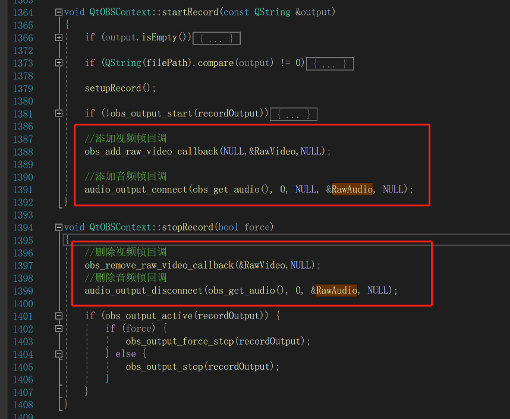

# obs简介(十一)---通过回调获取音视频帧

## 一. 方法


## 二. 具体函数与参数
- 接口
```
struct video_data {
	uint8_t *data[MAX_AV_PLANES];
	uint32_t linesize[MAX_AV_PLANES];
	uint64_t timestamp;
};

EXPORT void obs_add_raw_video_callback(const struct video_scale_info *conversion,void (*callback)(void *param, struct video_data *frame), void *param);
EXPORT void obs_remove_raw_video_callback(void (*callback)(void *param, struct video_data *frame), void *param);


struct audio_data {
	uint8_t *data[MAX_AV_PLANES];
	uint32_t frames;
	uint64_t timestamp;
};
EXPORT bool audio_output_connect(audio_t *video, size_t mix_idx, const struct audio_convert_info *conversion, audio_output_callback_t callback, void *param);
EXPORT void audio_output_disconnect(audio_t *video, size_t mix_idx, audio_output_callback_t callback, void *param);

```
- 使用
```
//添加视频帧回调
obs_add_raw_video_callback(NULL,&RawVideo,NULL);

//添加音频帧回调
audio_output_connect(obs_get_audio(), 0, NULL, &RawAudio, NULL);
    
void RawVideo(void *param, video_data *frame)
{
    for(int i =0;i<8;i++){
        if(frame->linesize[i])
        qDebug()<<"RoomWidget RawVideo:"<<i<<", linesize:"<<frame->linesize[i]<<",ts:" <<frame->timestamp;
    }
}

void RawAudio(void *param, size_t mix_idx,struct audio_data *data)
{
    qDebug()<<"RoomWidget RawAudio:"<<mix_idx<<":" <<data->frames;
}

//删除视频帧回调
obs_remove_raw_video_callback(&RawVideo,NULL);
//删除音频帧回调
audio_output_disconnect(obs_get_audio(), 0, &RawAudio, NULL);
```