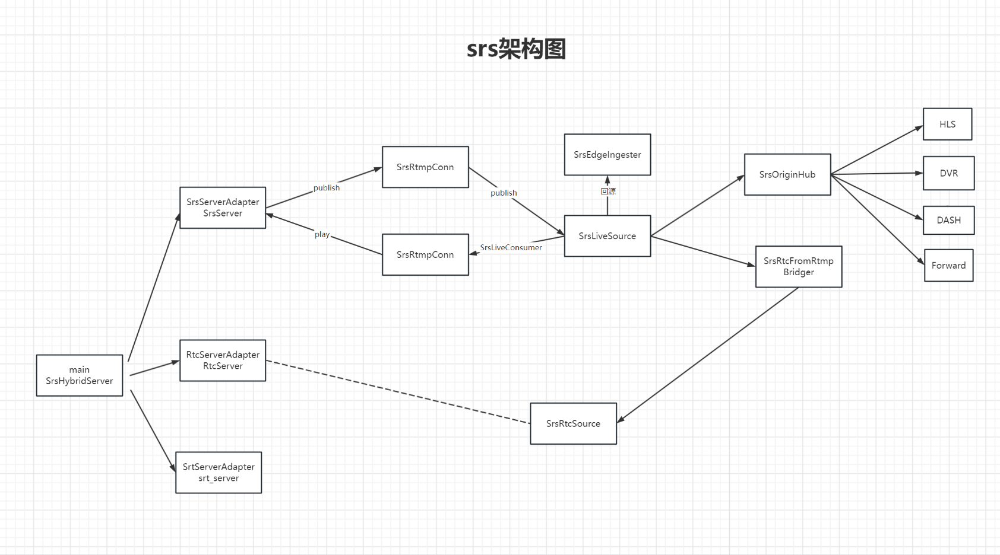
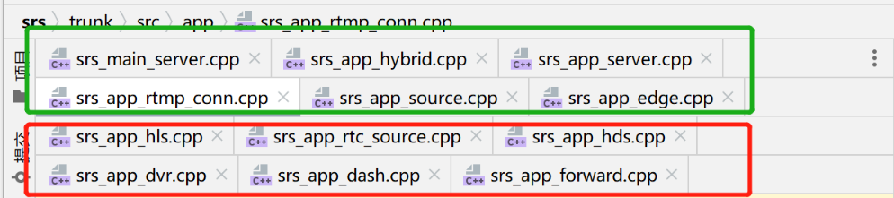
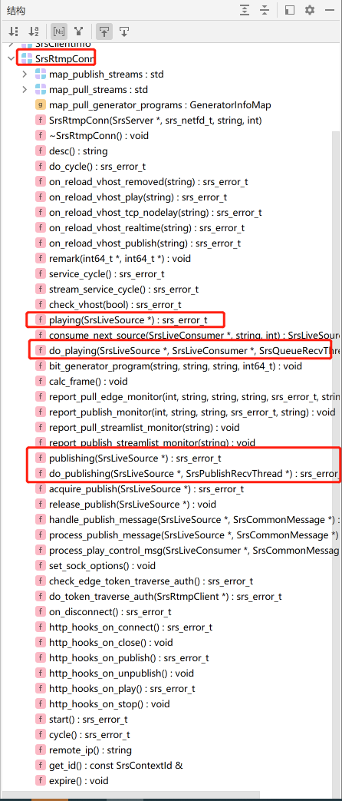
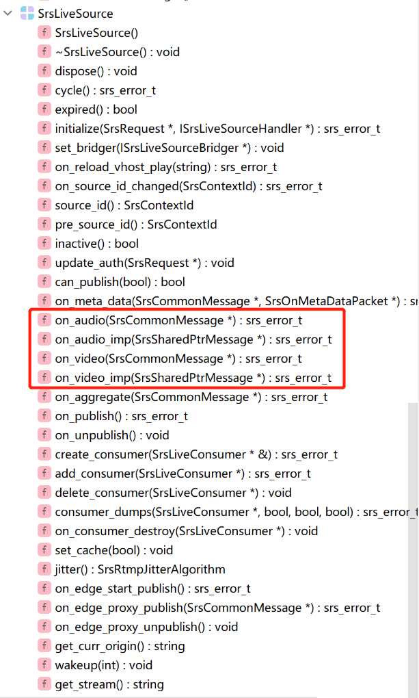

# srs源码学习1-主流程

## 一. RTMP核心类和文件

1. rtmp推流和拉流 -- 6个
   - srs_main_server.cpp
   - srs_app_hybrid.cpp
   - srs_app_server.cpp
   - srs_app_rtmp_conn.cpp
   - srs_app_source.cpp：source与consumer管理
   - srs_app_edge.cpp：边缘回源
2. rtmp分流 -- 6个
   - srs_app_hls.cpp
   - srs_app_rtc_source.cpp
   - srs_app_dvr.cpp
   - srs_app_dash.cpp
   - srs_app_hds.cpp
   - srs_app_forward.cpp
   

## 二. 核心函数

