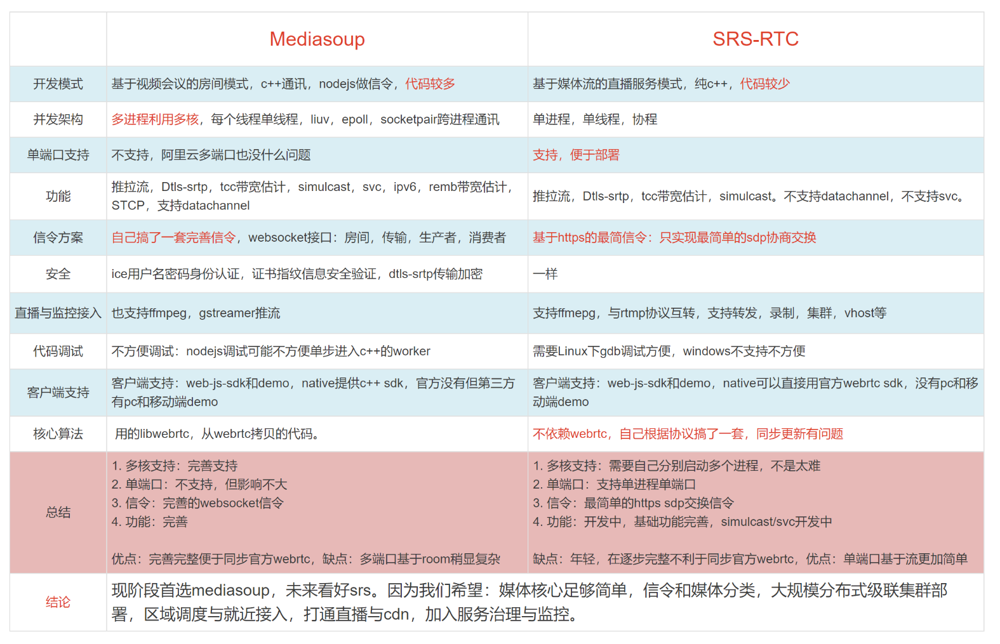

# srs源码学习2-webrtc

## 一. 比较


## 二. 信令
https://github.com/rtcdn/rtcdn-draft

## 三. 文件列表
```
./app/srs_app_rtc_api.cpp
./app/srs_app_rtc_api.hpp
./app/srs_app_rtc_codec.cpp
./app/srs_app_rtc_codec.hpp
./app/srs_app_rtc_conn.cpp
./app/srs_app_rtc_conn.hpp
./app/srs_app_rtc_dtls.cpp
./app/srs_app_rtc_dtls.hpp
./app/srs_app_rtc_queue.cpp
./app/srs_app_rtc_queue.hpp
./app/srs_app_rtc_sdp.cpp
./app/srs_app_rtc_sdp.hpp
./app/srs_app_rtc_server.cpp
./app/srs_app_rtc_server.hpp
./app/srs_app_rtc_source.cpp
./app/srs_app_rtc_source.hpp
./kernel/srs_kernel_rtc_rtcp.cpp
./kernel/srs_kernel_rtc_rtcp.hpp
./kernel/srs_kernel_rtc_rtp.cpp
./kernel/srs_kernel_rtc_rtp.hpp
./protocol/srs_rtc_stun_stack.cpp
./protocol/srs_rtc_stun_stack.hpp
./utest/srs_utest_rtc.cpp
./utest/srs_utest_rtc.hpp
```
## 四. 对象模型：
1. SrsRtcServer：单端口监听
2. SrsHttpServeMux* http_api_mux = _srs_hybrid->srs()->instance()->api_server();
3. SrsResourceManager* _srs_rtc_manager：管理SrsRtcConnection列表
4. SrsRtcConnection：每个http请求创建一个，streamid相同创建SrsRtcSource
   - ISrsRtcTransport* transport_;//SrsSecurityTransport
      - SrsDtls* dtls_; //SrsDtlsClientImpl / SrsDtlsServerImpl
      - SrsSRTP* srtp_;
   - map<std::string, SrsRtcPublishStream*> publishers_;
SrsRtcSource* source;
vector<SrsRtcAudioRecvTrack*> audio_tracks_;
vector<SrsRtcVideoRecvTrack*> video_tracks_;
map<std::string, SrsRtcPlayStream*> players_;
SrsRtcSource* source_;
map<uint32_t, SrsRtcAudioSendTrack*> audio_tracks_;
map<uint32_t, SrsRtcVideoSendTrack*> video_tracks_;
source->create_consumer(consumer)
on_stun
on_dtls
on_rtp
SrsRtcSource
ISrsRtcPublishStream* publish_stream_;
vector<SrsRtcConsumer*> consumers;
ISrsRtcSourceBridger* bridger_;
SrsRtcSource::on_rtp，分发到consumers和bridger_
SrsRtcSourceManager* _srs_rtc_sources ：管理source列表
SrsRtcSourceManager::fetch_or_create

数据流向

线程模型

协程的作用：在单线程环境下模拟多线程的开发方式。
还是单线程运行，但是按照多线程模式写代码，不用锁。改变了socket的编程方式。
如果没有协程：
单线程while循环不断轮询各个模块。
轮询各个模块封装起来：事件机制：有变化就回调，这种变化一定来自IO：文件，网络，键盘鼠标输入，系统虚拟输入等。
让单线程具有消息循环。各模块不断的在线程上异步调用+回调。windows提供的PostMessage，Google提供了queue。
协程实现类：SrsSTCoroutine，start方法就进入构成函数传入的cycle循环。

通俗易懂的回答:让原来要使用异步+回调方式写的非人类代码,可以用看似同步的方式写出来...
补充一个好处：可以按串行模型去组织原本分散在不同上下文中的代码逻辑，避免状态同步问题。
--------------------------------------------------------------------------------
发布播放共同：
创建一个RtcSource加到列表_srs_rtc_sources，类型SrsRtcSourceManager。发布和播放共享一个source，用stream_url做key。
创建一个SrsRtcConnection加到_srs_rtc_manager，类型SrsResourceManager。 username是key
发布：
在SrsRtcConnection创建一个SrsRtcPublishStream ：SrsRtcAudioRecvTrack，SrsRtcVideoRecvTrack，SrsRtmpFromRtcBridger。
SrsRtcPublishStream::send_periodic_twcc
播放：
在SrsRtcConnection创建一个SrsRtcPlayStream ：SrsRtcAudioSendTrack，SrsRtcVideoSendTrack。
SrsRtcPlayStream的协程cycle。
从source创建SrsRtcConsumer，并且加入到了source。
循环：dump_packet，send_packet
--------------------------------------------------------------------------------
数据流程：
SrsRtcServer::on_udp_packet
SrsRtcConnection::on_dtls/SrsRtcPublishStream::on_rtp
SrsRtcPublishStream::on_rtp
SrsSecurityTransport::unprotect_rtp
SrsRtcPublishStream::on_rtp_plaintext
rsRtcVideoRecvTrack::on_rtp
SrsRtcAudioRecvTrack::on_rtp
SrsRtcSource::on_rtp
SrsRtcConsumer::enqueue/SrsRtmpFromRtcBridger::on_rtp：放入队列
SrsRtcConsumer::dump_packet：拉取队列
SrsRtcVideoSendTrack::on_rtp
SrsRtcConnection::do_send_packet

启动流程：


