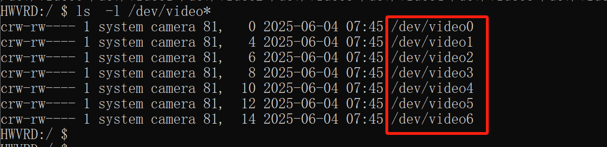
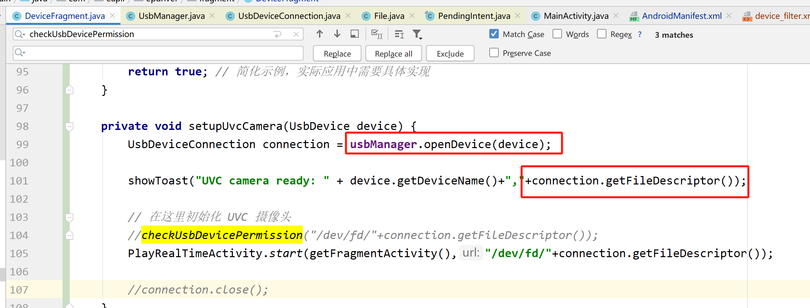
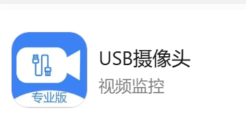
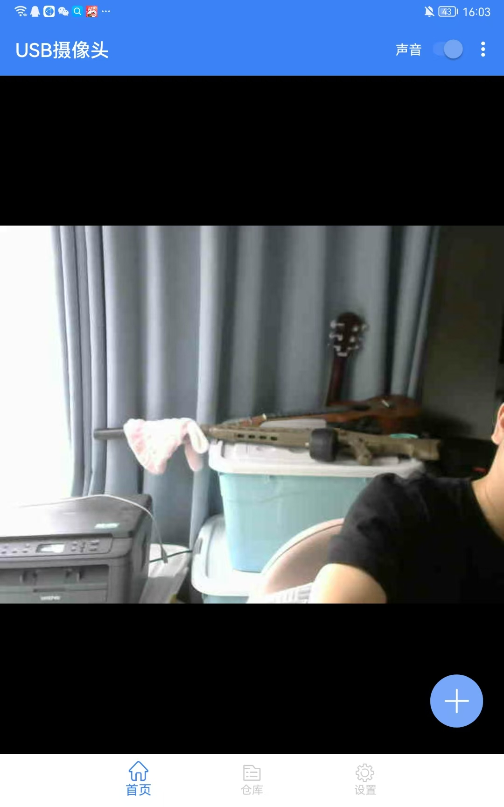
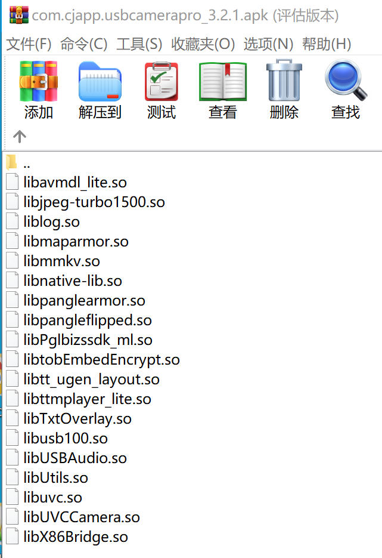

# uvc-android

## 文档
### Android对uvc摄像头支持的文档
The USB video device class (also USB video class or UVC)
1. As of the release of Android 10 (and still as of June 2020) Android does not support UVC [2] (USB video devices). 
   > 截至Android 10发布时（以及到2020年6月仍如此），Android系统不支持UVC[2]（USB视频设备）。
2. Earlier Android versions do support UVC. 
   > 早期的Android版本确实支持UVC。
3. As of December 2023 Feature drop update to Android 14 UVC support returns to the system.[3]
   > 根据2023年12月的功能更新，在Android 14中系统重新恢复了对UVC的支持[3]

### 来源
- https://en.wikipedia.org/wiki/USB_video_device_class
- https://source.android.google.cn/docs/core/camera/external-usb-cameras?hl=fi
- https://source.android.com/docs/core/camera/webcam?hl=zh-cn   


### ffmpeg在linux读取usb摄像头的数据
- ls /dev/video*
- ffmpeg -f v4l2 -s 640x480 -r 30 -i /dev/video0 output.mp4
- v4l2-ctl工具专门查看很多摄像头信息

## Android内核的设备挂在情况

1. 我这个用于保持七个，插入还不插入都没有变化,所有就是没有v4l2驱动再跑
2. 只看到usb驱动识别到了：/dev/bus/usb/002/003。也就是只有usb驱动，没有v4l2驱动。
3.  这种情况下自己写一个v412程序，估计也不行

## 相关命令
- zcat /proc/config.gz | grep *V4L2*
- dumpsys media.camera 
```
public void enumerateCamerasCamera2(Context context) {
    try {
        CameraManager manager = (CameraManager) context.getSystemService(Context.CAMERA_SERVICE);
        String[] cameraIds = manager.getCameraIdList();

        for (String cameraId : cameraIds) {
            CameraCharacteristics characteristics = manager.getCameraCharacteristics(cameraId);
            Integer facing = characteristics.get(CameraCharacteristics.LENS_FACING);

            if (facing != null) {
                switch (facing) {
                    case CameraCharacteristics.LENS_FACING_FRONT:
                        Log.e("CameraInfo", "Front camera found, ID: " + cameraId);
                        break;
                    case CameraCharacteristics.LENS_FACING_BACK:
                        Log.e("CameraInfo", "Back camera found, ID: " + cameraId);
                        break;
                    case CameraCharacteristics.LENS_FACING_EXTERNAL:
                        Log.e("CameraInfo", "External camera found, ID: " + cameraId);
                        break;
                }
            }
        }
    } catch (Exception e) {
        Log.e("CameraUtils", "Error enumerating cameras", e);
    }
}

public void enumerateCamerasCamera1(Context context) {
    for (int i = 0; i < Camera.getNumberOfCameras(); i++) {
        CameraInfo info=new CameraInfo();
        Camera.getCameraInfo(i,info);
        switch (info.facing) {
            case CameraInfo.CAMERA_FACING_FRONT:
                Log.e("CameraInfo", "Front camera found, ID: " + i);
                break;
            case CameraInfo.CAMERA_FACING_BACK:
                Log.e("CameraInfo", "Back camera found, ID: " + i);
                break;
        }
    }
}
```

## api

Android这边的权限是动态的： 只要插入usb就会收到通知
而且提供专有的api读写设备，能拿到fd用，不能直接访问文件
Android的权限管理专门提供了usb读写的usb设备访问api，

## 其他开发商的实现




## 方案
那么方案就定下来：只能用libusb+libuvc+libjpeg。
不能用系统api：Android 10，11，12，13不支持。
不能用ffmpeg的v4l2：Android 10，11，12，13不支持v4l2。

## 具体方案：
> 只有jiangdongguo和shiyinghan支持录制，shlllshlll不支持
2. https://github.com/jiangdongguo/AndroidUSBCamera
   - https://juejin.cn/post/7115229806844706847
   - 最近两三年前还在更新
   - kt语言
   - **https://github.com/shlllshlll/USBCamera 对jiangdongguo/AndroidUSBCamera的优化，没有录制**
   - 支持录制
1. https://github.com/shiyinghan/UVCAndroid
    - demo完善，但是预览黑屏
    - 支持录制
4. https://github.com/Liuguihong/AndroidUVCCamera
    - https://blog.csdn.net/u011630465/article/details/86511258
    - https://blog.csdn.net/u011630465/article/details/118968297?spm=1001.2014.3001.5501
    - 对https://github.com/saki4510t/UVCCamera的封装
    - 不支持录制
---
5. 最近在更新的项目：
   - https://github.com/cl-6666/uvcAndroid kt语言
   - https://github.com/xiaozhi003/AndroidUVCCamera java语言
   - https://github.com/RoboticsChen/uvccam4android 
   - https://github.com/catchpig/AndroidUVCCamera kt语言
   
2. https://github.com/MuZiLee/libuvccamera
    - 只是重新编译了armeabi的动态库os
3. https://github.com/galaxyzwj/libuvccamera
    - 仅仅是编译
1. 最终选择：
    - https://github.com/jiangdongguo/AndroidUSBCamera：最全
    - https://github.com/shlllshlll/USBCamera：不支持声音和录像

## AndroidUSBCamera源码解析
### 对象模型
1. DemoFragment.kt：**不需要持有对象**
2. CameraFragment.kt：**内部是一个MultiCameraClient.ICamera列表**
   - mCameraView: IAspectRatio
   - mCameraClient: MultiCameraClient
   - mCameraMap = hashMapOf<Int, MultiCameraClient.ICamera>()
   - mCurrentCamera: SettableFuture<MultiCameraClient.ICamera>
3. MultiCameraClient.kt
   - mUsbMonitor: USBMonitor
   - 管理设备的连接，连上回调的时候创建和打开CameraUVC
4. MultiCameraClient.ICamera和实现类CameraUVC.kt