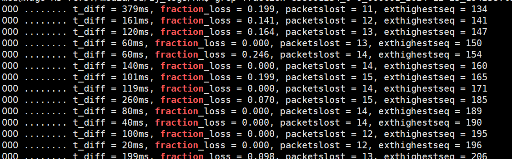
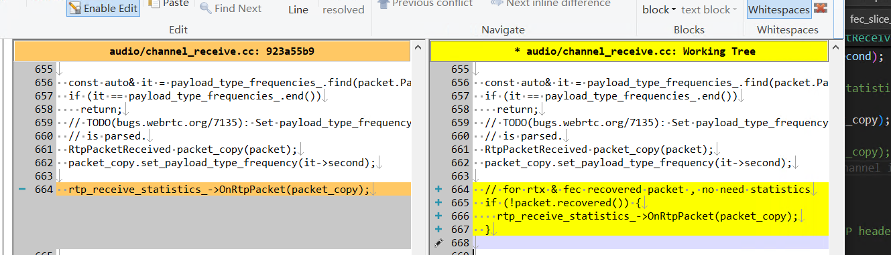

# 修复-WebRTC音频开启rtx和fec后丢包统计不对

## 一. 说明
1. webrtc音频默认：不开启nack-rtx，不开启fec，只支持opus的带内fec。
2. 为了对抗高丢包率，需要手动开启nack和fec。
3. 音频开启rtx和fec后，丢包率已经算不出来， 连累积loss都不准了。

## 二. 现象

## 三. 修复

解释
- 统计是在 接收流的 ChannelReceive 里做的。
- 这里会同时接口原始包和 修复还原后的包（相同的PT,SSRC）。 
- 但修复后的包带 recover标记， 可以在统计的时候跳过。
- 因为RTC音频之前没有RTX和 RED之外的 FEC， 统计的时候就没有判断 就搞乱了。

